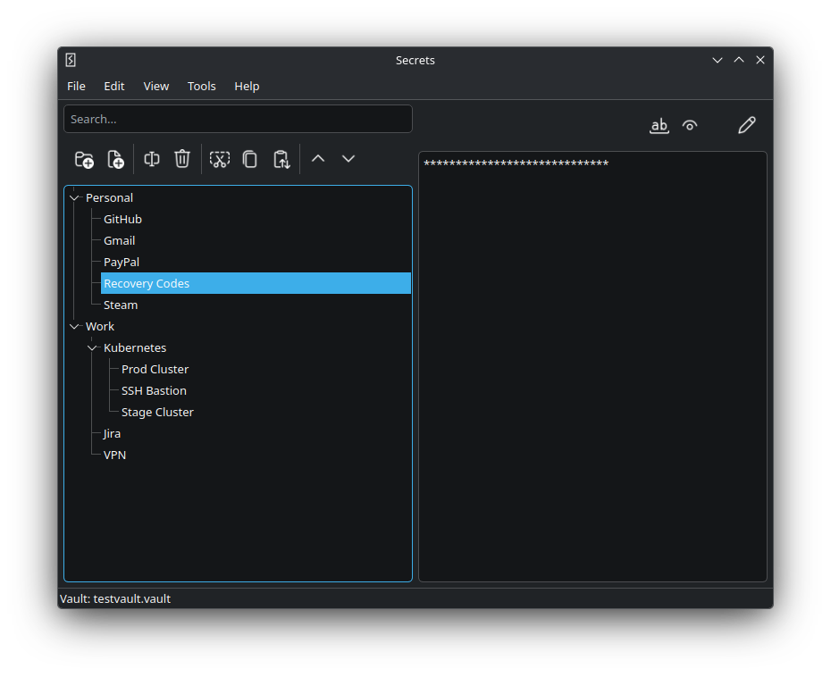

# Secrets

Desktop password manager written in C++17 and Qt6.

## Screenshot



## Features

- encrypted vault
- Argon2 key derivation
- AES encryption
- XML export
- system tray support
- Linux and Windows

## Build

Requirements:

- Qt 6.5+
- OpenSSL
- Argon2

```bash
mkdir build
cd build

cmake ..
cmake --build .
